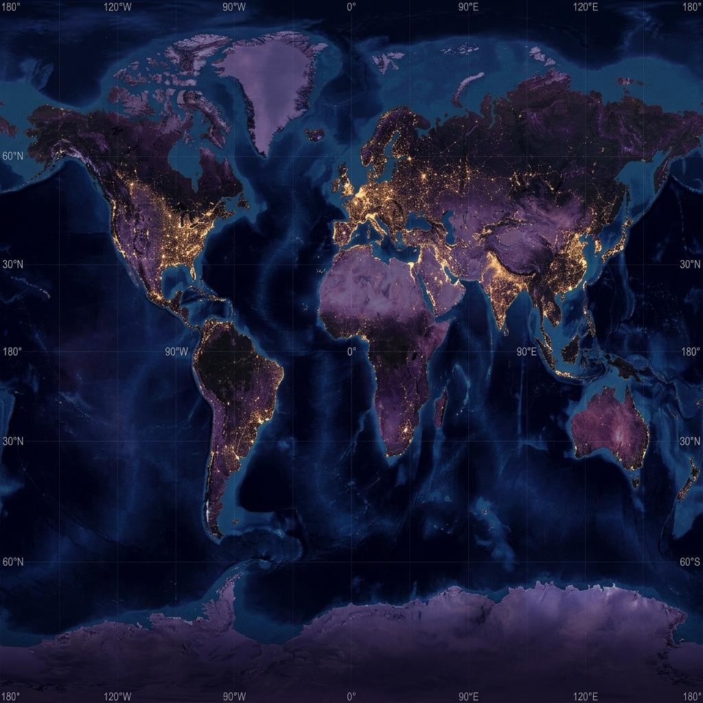

# CosmosX

> **Explore the Past. Visualize the Present. Simulate the Future — an immersive 3D space exploration platform powered by real orbital mechanics, AI scenario analysis, and live space news.**

[](https://nextjs.org)
[](https://react.dev)
[](https://threejs.org)
[](https://groq.com)
[](https://tailwindcss.com)
[](LICENSE)

---

## Preview



---

## What It Does

CosmosX is a full-stack Next.js 15 web app that turns space exploration into an interactive experience. A live 3D solar system greets you on arrival, rendered with 6,000+ stars and real Keplerian orbital dynamics. From there you can step through the history of space exploration, browse live mission news, simulate "what if" cosmic scenarios with an AI engine, and discover your cosmic crew role — all without leaving the browser.

The AI scenario engine uses **Groq (LLaMA 3.1-8b-instant)** to analyze user-defined hypotheticals and returns structured scientific breakdowns. Text-to-speech narration is optionally powered by **Deepgram** so every analysis can be read aloud. Space news is pulled in real time from the public **SpaceflightNewsAPI** — no API key required.

---

## Features

### 3D Solar System

A real-time WebGL universe built with Three.js and React Three Fiber. Six thousand stars twinkle in the background while all eight planets trace accurate elliptical orbits. The home page hero runs an animated solar system on a looping video backdrop — GPU instancing keeps it smooth even on mid-range hardware.

### AI Scenario Simulator

Type any "what if" about the cosmos — *What if Jupiter disappeared? What if Earth had two moons? What if the Sun were twice as massive?* — and the Groq-powered engine returns a structured breakdown: scientific explanation, physical impacts, a cascading timeline of effects, and a survivability rating. Three pre-built scenarios let you jump in immediately. Optional Deepgram text-to-speech narrates the full analysis on demand.

### Cosmic Timeline

An interactive chronological record of humanity's greatest space milestones — from Sputnik (1957) through Apollo 11, Voyager, Hubble, the ISS, James Webb, Chandrayaan-3, and a projected Mars colony (2050). Each entry expands to show mission facts and a full description in an alternating left-right layout.

### Live Space News

Aggregated articles from SpaceflightNewsAPI in an animated card grid. Filter by year from 2010 through the latest — every card shows the headline, summary, image, and a direct link to the source.

### Crew Registry & Role-Finder Quiz

Four fictional crew members with detailed dossiers, security clearances, and sci-fi bios. A 3-question role-finder quiz — drawing on live Earth–Mars and Earth–Jupiter distance data calculated from real orbital elements — assigns you one of three roles: **Quantum Propulsion Engineer**, **Deep Space Cartographer**, or **Astrobiologist**.

### Dark Pattern Detection

| Role | What it means |
|---|---|
| **Quantum Propulsion Engineer** | You think in systems and love pushing boundaries |
| **Deep Space Cartographer** | You chart the unknown and thrive on discovery |
| **Astrobiologist** | You search for life and ask the biggest questions |

### Contact / Sub-Space Transmission

A sci-fi themed contact form that animates an "uplink" progress bar on submission and responds with mission-control flavor text.

---

## Quick Start

**Prerequisites:** Node.js 18+ · A free Groq API key (for the simulator) · Optional Deepgram key (for narration)

### 1. Clone

```bash
git clone https://github.com/<your-username>/cosmosx.git
cd cosmosx-
```

### 2. Install

```bash
npm install
```

### 3. Environment

```bash
cp .env.example .env.local
```

Fill in `.env.local`:

```env
GROQ_API_KEY=gsk_...your_key_here
DEEPGRAM_API_KEY=...your_key_here   # optional — narration only
```

Get a free Groq key at [console.groq.com/keys](https://console.groq.com/keys) — the free tier is more than enough for personal use. Space news works without any key (public API).

Without a Groq key, the simulator still plays 3D visuals but the AI analysis panel shows a "not configured" message.

### 4. Run

```bash
npm run dev
# → http://localhost:3000
```

---

## API Routes

All routes return JSON. Base URL in development: `http://localhost:3000`.

| Method | Endpoint | Description | Key Required |
|---|---|---|---|
| POST | `/api/scenario` | Analyze a cosmic "what if" with Groq AI | `GROQ_API_KEY` |
| GET | `/api/news` | Fetch space news articles, filtered by year | None |
| GET | `/api/quiz` | Generate today's space quiz with live planetary data | `GROQ_API_KEY` |
| POST | `/api/speak` | Convert text to speech audio via Deepgram | `DEEPGRAM_API_KEY` |

**Analyze a scenario:**

```bash
curl -X POST http://localhost:3000/api/scenario \
  -H "Content-Type: application/json" \
  -d '{"scenario": "What if Jupiter suddenly disappeared?"}'
```

```json
{
  "explanation": "Jupiter acts as a gravitational shield for the inner planets...",
  "impacts": ["Asteroid belt destabilized", "Inner planet orbits shift"],
  "timeline": "0–10 years: increased asteroid flux toward Earth...",
  "survivability": "Low"
}
```

**Fetch space news by year:**

```bash
curl "http://localhost:3000/api/news?year=2024"
```

**Generate text-to-speech:**

```bash
curl -X POST http://localhost:3000/api/speak \
  -H "Content-Type: application/json" \
  -d '{"text": "Jupiter acts as a gravitational shield for the inner planets."}'
# → returns audio/mpeg binary stream
```

---

## Project Structure

```
cosmosx/
├── README.md
│
├── app/                              ← Next.js App Router
│   ├── layout.tsx                    # Root layout — fonts, Vercel analytics
│   ├── page.tsx                      # Home — hero video, 3D solar system
│   ├── timeline/page.tsx             # Cosmic Timeline
│   ├── missions/page.tsx             # Live Space News
│   ├── about/page.tsx                # Crew dossiers, quiz, contact form
│   ├── simulate/page.tsx             # Scenario Simulator shell
│   ├── globals.css                   # Global styles + keyframe animations
│   └── api/
│       ├── scenario/route.js         # POST — Groq AI scenario analysis
│       ├── news/route.js             # GET — SpaceflightNewsAPI proxy
│       ├── quiz/route.js             # GET — daily quiz generation
│       └── speak/route.js            # POST — Deepgram TTS
│
├── components/
│   ├── Header.tsx                    # Navigation bar
│   ├── GlobalCosmos.tsx              # Three.js 6,000-star background
│   ├── AmbientCosmos.tsx             # Canvas-based particle fallback
│   ├── HeroScene.tsx                 # 3D scene for the simulator panel
│   ├── SimulatorClient.tsx           # Client wrapper — dynamic import guard
│   ├── SolarSystem.tsx               # Animated orbital solar system
│   ├── ScenarioSimulator.jsx         # Full simulator UI + AI result panel
│   ├── ConstellationTimeline.tsx     # Timeline with expandable milestone cards
│   ├── SpaceNews.tsx                 # News card grid with year filter
│   └── MissionFlashcard.tsx          # Individual mission detail card
│
├── data/
│   ├── planets.js                    # 8 planets — name, color, size, orbit, speed, facts
│   ├── missions.js                   # Space milestone records (Sputnik → Mars 2050)
│   ├── prompts.js                    # System prompts for Groq scenario analysis
│   └── quizQuestions.js              # Pre-seeded quiz question bank
│
├── lib/
│   └── orbital-mechanics.js          # Julian date + Keplerian angle calculations
│
├── public/
│   ├── hero_bg.mp4                   # Hero section background video
│   ├── milkyway.mp4                  # Secondary space background
│   └── planet_map.png                # Planet texture map
│
├── .env.local                        # API keys — never commit
├── next.config.ts                    # Next.js configuration
├── tsconfig.json                     # TypeScript config with @ path alias
└── package.json                      # Dependencies + scripts
```

---

## Tech Stack

| | Purpose |
|---|---|
| [](https://nextjs.org) | Full-stack React framework (App Router) |
| [](https://react.dev) | UI library |
| [](https://threejs.org) | WebGL 3D rendering engine |
| [](https://r3f.docs.pmnd.rs) | React renderer for Three.js |
| [](https://github.com/pmndrs/drei) | Reusable 3D helpers & abstractions |
| [](https://groq.com) | AI scenario analysis & quiz generation |
| [](https://deepgram.com) | Text-to-speech narration (optional) |
| [](https://tailwindcss.com) | Utility-first styling |
| [](https://www.framer.com/motion/) | Page & component animations |
| [](https://lucide.dev) | UI icons |
| [](https://vercel.com/analytics) | Usage analytics |

---

## Orbital Mechanics

Live planetary distances shown in the quiz are not hardcoded. `lib/orbital-mechanics.js` computes each planet's current ecliptic longitude using the **J2000.0 epoch** and mean orbital elements (semi-major axis, eccentricity, mean anomaly, inclination), then derives the Earth–planet distance in AU via the law of cosines. The result updates on every quiz load.

---

## Deploy to Vercel

CosmosX is a Next.js 15 app — Vercel deploys it in one step with zero config.

### 1. Push to GitHub

```bash
git push origin main
```

### 2. Connect to Vercel

1. Go to [vercel.com](https://vercel.com) → **Add New** → **Project** → import your repo
2. Vercel auto-detects Next.js — no build configuration needed
3. Add environment variables in the Vercel dashboard:

| Variable | Value |
|---|---|
| `GROQ_API_KEY` | Your Groq API key |
| `DEEPGRAM_API_KEY` | Your Deepgram API key (optional) |

4. Click **Deploy** — live in ~60 seconds

> The Vercel free tier handles CosmosX comfortably. The Groq free tier supports thousands of scenario analyses per day.

---

## Roadmap

- [ ] Orrery mode — pause, scrub time, and watch orbital positions change
- [ ] Webb telescope image gallery with NASA APOD integration
- [ ] Exoplanet explorer — filter Kepler/TESS discoveries by habitability zone
- [ ] Shareable scenario cards — export AI analysis as a styled PNG
- [ ] Voice input for scenario prompts (Web Speech API)
- [ ] Mobile-optimised 3D with adaptive quality based on device GPU tier
- [ ] Multiplayer crew mode — share a quiz session with friends

---

## License

MIT License — see [LICENSE](LICENSE) for details.

---

## Acknowledgements

- AI analysis by [Groq](https://groq.com) running [LLaMA 3.1](https://llama.meta.com/) (llama-3.1-8b-instant)
- Text-to-speech by [Deepgram](https://deepgram.com) (aura-2-pluto-en)
- Space news from [SpaceflightNewsAPI](https://api.spaceflightnewsapi.net)
- 3D powered by [Three.js](https://threejs.org), [React Three Fiber](https://r3f.docs.pmnd.rs), and [Drei](https://github.com/pmndrs/drei)
- Icons by [Lucide](https://lucide.dev)
- Animations by [Framer Motion](https://www.framer.com/motion/)
- Fonts: [Cormorant Garamond](https://fonts.google.com/specimen/Cormorant+Garamond), [Plus Jakarta Sans](https://fonts.google.com/specimen/Plus+Jakarta+Sans)
